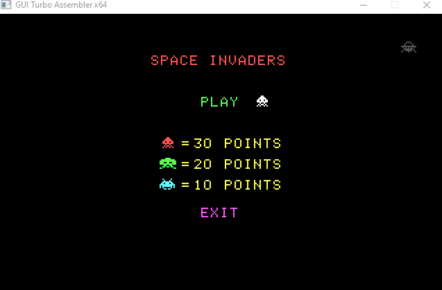
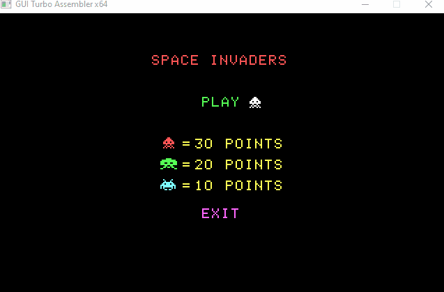

# Space Invaders: x86 Assembly Game Engine (v2.0)

## Project Overview
This repository contains a high-performance clone of the classic **Space Invaders**, engineered entirely in **x86 Assembly (16-bit Real Mode)**. Version 2.0 represents a significant evolution from a simple prototype to a robust game engine, implementing advanced memory manipulation, flicker-free rendering, and data persistence.

---

## Technical Specifications
* **Architecture:** x86 16-bit (Intel 8086/8088 compatible)
* **Environment:** MS-DOS / DOSBox (Fully compatible with Xubuntu/Linux setups)
* **Graphics Mode:** BIOS Video Mode 13h (320x200 pixels, 256 colors)
* **Language:** Intel Assembly (TASM/MASM syntax)
* **Input Systems:** Dual-mode (BIOS Keyboard Interruption + Mouse Int 33h)

---

## Engineering Highlights (Version 2.0)

### 1. Advanced Graphics Pipeline (Double Buffering)
Unlike v1.0, which suffered from screen flickering due to direct VRAM access, v2.0 implements a **Back-Buffer Architecture**:
* **Memory Mapping:** A dedicated 64KB RAM segment (`BUFFSEG`) serves as a secondary canvas.
* **Synchronization:** All rendering macros target the buffer. A high-speed `rep movsw` operation synchronizes the buffer with the VRAM segment (**0A000h**) during the vertical retrace.
* **Mathematical Precision:** Pixel plotting is handled via the linear mapping formula: 
  $$Index = (Y \cdot 320) + X$$

### 2. Data Persistence & I/O
* **High Score Serialization:** Implements a custom **Integer-to-ASCII (itoa)** algorithm to convert 16-bit binary scores into human-readable characters.
* **File Management:** Uses `int 21h` (functions `3Ch` and `40h`) for automated creation and writing of score logs in `.txt` format.

### 3. Integrated Peripheral Support
* **Mouse Interfacing:** The main menu utilizes `int 33h` for real-time cursor tracking and click detection.
* **Coordinate Normalization:** Since the mouse driver operates on a 640-unit horizontal scale, the engine applies bitwise shifts (`shr cx, 1`) to map coordinates correctly to the 320-pixel Mode 13h grid.
### 4. Custom Sprite-based Font Engine
To maintain visual consistency and bypass the limitations of standard BIOS fonts, v2.0 implements a **custom-made digit rendering system**:
* **Matrix Typography:** Digits 0-9 are stored as $3 \times 5$ or $5 \times 7$ bit-matrices within the `DATASG`.
* **Procedural Drawing:** A specialized procedure iterates through these matrices, plotting pixels directly onto the back-buffer, allowing for seamless integration with the game's art style and real-time scaling.
---

## Visual Comparison: Rendering Evolution

| v1.0: Direct-to-VRAM (Flickering) | v2.0: Double Buffering (Smooth) |
|:---:|:---:|
|  |  |

---

## Memory Architecture & Security
The software follows a strict **Segmented Memory Model** to ensure stability:
* **`STACKSG`:** Expanded to 512 bytes to support complex macro expansions and deep procedure calls.
* **`DATASG`:** Houses entity state matrices, sprite bitmaps, and I/O buffers.
* **Segment Protection:** Critical routines use `push ds / pop es` patterns to ensure string operations (`movsb`/`stosb`) are context-safe, preventing memory corruption.

---

## Development Roadmap

### **Phase 1: Baseline Prototype (v1.0) - COMPLETED**
* Basic game loop and BIOS-based rendering.
* Simple collision detection.

### **Phase 2: Performance & UX (v2.0) - CURRENT**
* **Double Buffering:** Eliminated screen flickering.
* **File System:** High score persistence in `.txt` files.
* **Mouse Support:** Interactive GUI menu.
* **Input Optimization:** Non-blocking keyboard buffer flushing.

### **Phase 3: Advanced Hardware (Upcoming)**
* **PC Speaker Audio:** Implementation of sound effects via Port 61h.
* **Custom ISR:** Writing a dedicated Interrupt Service Routine for the keyboard to handle multi-key ghosting.

---

## How to Build

### Using Borland Turbo Assembler (TASM):

**1. Assemble the source:**
```bash
tasm /zi space.asm
```

**2. Link the object file:**
```bash
tlink /v space.obj
```

**3. Run in DOSBox:**
```bash
space.exe
```

---

> **Developer Note:** This project serves as a deep dive into low-level systems architecture, demonstrating that even with the constraints of 16-bit real mode, high-performance interactive software is achievable through optimized memory management.
```
